# ResFrac — Secure Azure Platform (Senior Azure DevOps Assignment)

A production-grade, **fully passwordless** Azure solution demonstrating secure
application design, Infrastructure-as-Code, CI/CD, and operations:

- **Node.js REST API** with Microsoft Entra ID (OAuth2/JWT) auth, Key Vault, and
  Azure SQL — all accessed via **Managed Identity**.
- **Python Azure Function** (timer + HTTP) writing to Storage via
  **identity-based** (keyless) connections.
- **Modular Bicep** for all infrastructure, with an optional private-networking
  posture (VNet + private endpoints).
- **Azure DevOps multi-stage pipeline** with **Workload Identity Federation**
  (no stored cloud secrets), environment approvals, and smoke-test gating.
- **Full observability**: Log Analytics, Application Insights, and the three
  required alert classes (availability, application failure, infrastructure).

> **Status of live deployment:** this solution has been **deployed and verified
> live on Azure** (dev, `centralus`). All smoke tests pass end-to-end — `/health`,
> `/health/ready` (SQL + Key Vault via Managed Identity), anonymous `401`,
> authorized `200` returning real data, and the Function's Storage path — and the
> CI/CD pipeline runs **green** with secretless OIDC. See
> [`docs/LIVE-DEPLOYMENT.md`](docs/LIVE-DEPLOYMENT.md) for the evidence, resource
> inventory, and teardown. It is also validated locally (unit tests, Bicep
> compilation, script/YAML parsing — see [Verification](#verification)).
>
> **Authorship:** all work in this repository is authored by **Abicloudexpert**.
> AI tooling was used as a permitted pair-programming aid (see
> [`docs/AI-USAGE.md`](docs/AI-USAGE.md) and
> [`docs/PROMPT-HISTORY.md`](docs/PROMPT-HISTORY.md)); every decision is
> understood and defensible.

---

## Table of contents

- [Architecture](#architecture)
- [Repository layout](#repository-layout)
- [Prerequisites](#prerequisites)
- [Local development](#local-development)
- [One-time Azure / Azure DevOps setup](#one-time-azure--azure-devops-setup)
- [Deploying to Azure](#deploying-to-azure)
- [CI/CD pipeline](#cicd-pipeline)
- [Security](#security)
- [Monitoring & operations](#monitoring--operations)
- [Verification](#verification)
- [Assumptions & trade-offs](#assumptions--trade-offs)
- [Future improvements](#future-improvements)
- [AI-assisted development](#ai-assisted-development)

---

## Architecture

See [`docs/architecture.md`](docs/architecture.md) for the full write-up and
diagrams (system, auth flow, deployment flow, monitoring).



---

## Repository layout

```
.
├── apps/
│   ├── api/                 # Node.js API (Express, Entra ID JWT, KV, SQL via MI)
│   │   ├── src/             #   config, auth, services (db/keyvault), routes, telemetry
│   │   └── test/            #   jest + supertest (offline, hermetic)
│   └── function/            # Python Azure Function (v2 model)
│       ├── shared/          #   testable business logic (storage, processor)
│       ├── function_app.py  #   timer + HTTP triggers
│       └── tests/           #   pytest
├── infra/
│   ├── bicep/               # Modular IaC
│   │   ├── main.bicep       #   orchestrator
│   │   ├── modules/         #   monitoring, network, storage, keyvault, sql, plan,
│   │   │                    #   api-app, function-app, rbac, alerts
│   │   └── params/          #   dev.bicepparam, prod.bicepparam
│   ├── scripts/             # PowerShell automation (provision/deploy/monitor/teardown)
│   └── sql/                 # schema + MI grant template + passwordless runner
├── pipelines/
│   ├── azure-pipelines.yml  # multi-stage: Build → Deploy Dev → Deploy Prod
│   └── templates/           # reusable stage/step templates
└── docs/                    # architecture, security, monitoring, runbook, ADRs
```

---

## Prerequisites

**Local tooling**

| Tool | Version | Used for |
|------|---------|----------|
| Node.js | 20+ (tested on 22) | API build/test |
| Python | 3.11 | Function build/test |
| Azure CLI (`az`) | 2.60+ | provisioning/deployment |
| Bicep | 0.30+ | IaC compilation (`az bicep install`) |
| PowerShell (`pwsh`) | 7+ | automation scripts |
| `sqlcmd` (optional) | go-sqlcmd | SQL migration from a workstation |
| Azure Functions Core Tools (optional) | v4 | run the Function locally |

**Azure**

- A subscription with rights to create the resource types used here.
- An Entra ID **App Registration** for the API (exposes an app role / scope
  `Data.Read`).
- An Entra **group** to be the Azure SQL admin (recommended over an individual).

---

## Local development

### API

```bash
cd apps/api
cp .env.example .env          # fill in tenant/client ids as needed
npm ci
npm test                      # jest + coverage (fully offline)
npm run lint
npm start                     # serves on :8080  (GET /health)
```

The API is dependency-injected: Key Vault, SQL and the JWT key resolver are
mockable, so the entire test suite runs with **no Azure connectivity**.

### Function

```bash
cd apps/function
python3 -m venv .venv && source .venv/bin/activate
pip install -r requirements-dev.txt
pytest                        # unit + binding smoke tests
ruff check .
# To run the host locally (requires Azure Functions Core Tools + Azurite):
# cp local.settings.json.example local.settings.json && func start
```

---

## One-time Azure / Azure DevOps setup

These steps establish identity and secretless CI. They are needed once per
environment.

1. **API App Registration** (token audience):
   ```bash
   az ad app create --display-name "resfrac-api" \
     --identifier-uris "api://<will-be-set-to-appId>"
   # Expose an app role "Data.Read" (application) and/or a delegated scope.
   ```
   Record the **Application (client) ID** → `apiClientId`.

2. **SQL admin group**: create/choose an Entra group; record its **object id**
   → `sqlAdminObjectId` and display name → `sqlAdminLogin`.

3. **Workload Identity Federation service connection** (Azure DevOps →
   *Project settings → Service connections → Azure Resource Manager → Workload
   Identity federation*). This creates an app registration with a **federated
   credential** trusting your ADO org — **no client secret is stored**.
   Grant it: `Contributor` on the target resource group(s), `Key Vault Secrets
   Officer` on the vault (to seed secrets), and add it to the SQL admin group
   (so it can run migrations). Record the connection name →
   `azureServiceConnection`.

4. **Variable groups** (Azure DevOps → *Library*):
   - `resfrac-common`: `azureServiceConnection`, `tenantId`, `location`
   - `resfrac-dev` / `resfrac-prod`: `resourceGroup`, `apiClientId`,
     `sqlAdminObjectId`, `sqlAdminLogin`, `alertEmail`, `apiAudience`
     (`api://<apiClientId>`), `smokeClientId`, **`smokeClientSecret` (secret)**.
     Link secret values from Key Vault where possible.

5. **Environments** (Azure DevOps → *Pipelines → Environments*): create
   `resfrac-dev` and `resfrac-prod`; add an **Approval** check on
   `resfrac-prod`.

---

## Deploying to Azure

### Option A — scripted (from a workstation)

```bash
# Log in and select the subscription
az login
az account set --subscription <sub-id>

# 1) Provision infrastructure + configure KV secret + SQL schema/grants
pwsh infra/scripts/provision.ps1 -Environment dev -Location eastus2 `
  -ApiClientId <api-app-client-id> `
  -SqlAdminObjectId <entra-group-object-id> `
  -SqlAdminLogin 'sg-resfrac-sql-admins' `
  -AlertEmail platform-alerts@yourco.com

# 2) Deploy application code (names are printed by provision.ps1)
pwsh infra/scripts/deploy-apps.ps1 -ResourceGroup rg-resfrac-dev `
  -ApiName <app-name> -FunctionName <func-name>

# 3) Validate
pwsh infra/scripts/smoke-test.ps1 -ApiUrl https://<app>.azurewebsites.net `
  -FunctionUrl https://<func>.azurewebsites.net

# 4) (optional) day-2 monitoring config
pwsh infra/scripts/configure-monitoring.ps1 -ResourceGroup rg-resfrac-dev `
  -AlertEmail oncall@yourco.com

# 5) Teardown when finished
pwsh infra/scripts/teardown.ps1 -ResourceGroup rg-resfrac-dev -PurgeKeyVault
```

All scripts are **idempotent** and support `-WhatIf` where applicable.

### Option B — pipeline

Push to `main` (or open a PR) after completing the one-time setup. The pipeline
builds, deploys to **dev**, runs smoke tests, then waits for approval before
**prod**.

---

## CI/CD pipeline

Defined in [`pipelines/azure-pipelines.yml`](pipelines/azure-pipelines.yml):

| Stage | What it does |
|-------|--------------|
| **Build & Test** | `npm ci`→lint→jest (API); `pip`→ruff→pytest (Function); publishes JUnit + coverage; packages `api.zip` / `function.zip` |
| **Deploy Dev** | Bicep `what-if` → deploy → seed KV secret → SQL schema + MI grants → zip-deploy apps → smoke tests |
| **Deploy Prod** | Same, behind an environment **approval**, only from `main` |

Reusable templates live in `pipelines/templates/`. The same Bicep and PowerShell
used locally are invoked by the pipeline (single source of truth).

---

## Security

Full details in [`docs/SECURITY.md`](docs/SECURITY.md). Highlights:

- **No credentials in source control** — enforced by `.gitignore` and design;
  secrets live in Key Vault, injected at runtime via Managed Identity.
- **Passwordless data plane** — Managed Identity for KV + SQL + Storage; SQL is
  Entra-only; Storage shared-key access is disabled.
- **Least privilege RBAC** — narrow built-in roles per identity.
- **Secretless CI** — Workload Identity Federation (OIDC), no service-principal
  secrets.
- **Network isolation** — private endpoints + disabled public access in prod.
- **App hardening** — Helmet, CORS allow-list, rate limiting, TLS 1.2, HTTPS
  only, FTPS disabled, no stack traces to clients, structured logs.

---

## Monitoring & operations

Full details in [`docs/MONITORING.md`](docs/MONITORING.md) and the on-call
[`docs/RUNBOOK.md`](docs/RUNBOOK.md). Includes the three required alerts, how to
investigate incidents (KQL queries provided), and rollback/recovery procedures.

---

## Verification

Everything that can be verified without a live subscription **has been**:

| Check | Command | Result |
|-------|---------|--------|
| API unit tests + coverage | `cd apps/api && npm test` | 17 tests pass |
| API lint | `cd apps/api && npm run lint` | clean |
| Function unit tests | `cd apps/function && pytest` | 8 tests pass |
| Function lint | `ruff check .` | clean |
| Bicep compiles | `az bicep build -f infra/bicep/main.bicep` | no warnings/errors |
| Param files | `az bicep build-params ...` | valid |
| PowerShell scripts | AST parse of all `*.ps1/*.psm1` | clean |
| Pipeline YAML | YAML parse of all pipeline files | valid |

---

## Assumptions & trade-offs

- **Dedicated App Service Plan** (not Consumption Functions) is used so the
  Function can use **identity-based storage** without an Azure Files content
  share, integrate with the VNet, and avoid cold starts. Trade-off: a small
  always-on cost; acceptable and cost-shared with the API on one plan.
- **Single storage account** serves both the Function's data (heartbeats) and
  its host storage via identity-based connections. For very high-scale hosts you
  would separate runtime vs data storage.
- **SQL contained-user creation** is done via T-SQL (ARM cannot express it); the
  deployment identity must be a SQL Entra admin to run it.
- **Demo secret** (`api-feature-flag`) is a stand-in for real application
  secrets; it is seeded out-of-band, never committed.
- Placeholder GUIDs in `*.bicepparam` must be replaced with real values (or
  overridden by the pipeline variable group).

---

## Future improvements

- **Azure Front Door / APIM** in front of the API for WAF, rate limiting at the
  edge, and OAuth token validation offload.
- **Blue/green or slot-based deployments** with automated rollback on smoke
  failure.
- **Deployment stacks** (Bicep) for lifecycle-managed, drift-controlled infra.
- **Private DNS + fully private CI** using a self-hosted agent inside the VNet
  for prod migrations.
- **Chaos/load testing** and SLO-based alerting (burn-rate alerts).
- **Secret rotation** automation and Key Vault reference app settings.

---

## AI-assisted development

Per the assignment's AI policy, see [`docs/AI-USAGE.md`](docs/AI-USAGE.md) for how
AI tooling was used and how to reproduce/understand every generated artifact.
