# Monitoring & Alerting

How the platform is observed, alerted on, investigated, and recovered.



## 1. Telemetry pipeline

- **Application Insights (workspace-based)** collects requests, dependencies,
  exceptions, traces and custom events from both apps.
  - API: `applicationinsights` SDK auto-collects HTTP, dependencies (SQL, KV),
    console and exceptions; W3C distributed tracing enabled; cloud role set.
  - Function: the Functions host forwards `logging` output automatically;
    `custom_dimensions` add structured context.
- **Log Analytics Workspace** is the single sink. Every resource (App Service,
  Function, Key Vault, SQL, Storage) has **diagnostic settings** streaming logs
  and metrics into it.
- Retention: 30 days (dev) / 90 days (prod), configurable.

## 2. Alerts (the three required classes)

All alerts route to a single **Action Group** (`ag-<env>`) with an email
receiver (extendable to Teams/PagerDuty/webhook). Defined in
`infra/bicep/modules/alerts.bicep`.

| # | Class | Signal | Condition | Severity |
|---|-------|--------|-----------|----------|
| 1 | **Availability / health** | Standard web test on `/health` from 5 regions | ≥ 2 locations failing over 5 min | Sev1 |
| 2 | **Application failure** | App Insights `requests/failed` | > 5 failed requests in 5 min | Sev2 |
| 3 | **Infrastructure** | App Service Plan `CpuPercentage` | > 80% average over 15 min | Sev2 |

Additional signals available in Log Analytics for future alerting: SQL DTU/CPU,
Key Vault throttling, storage availability, Function failures.

## 3. Investigating an incident

**Starting point:** the alert email links to the fired alert and the affected
resource. Then:

1. **Confirm scope** in App Insights → *Failures* and *Performance* blades
   (which operation, which dependency, error rate, impacted users).
2. **Trace a failing request** end-to-end using the `operation_Id` (distributed
   tracing links API → SQL/KV dependencies).
3. **Query Log Analytics** (KQL examples):

   Failed requests in the last hour, by operation:
   ```kusto
   requests
   | where timestamp > ago(1h) and success == false
   | summarize count() by name, resultCode
   | order by count_ desc
   ```

   Recent exceptions with messages:
   ```kusto
   exceptions
   | where timestamp > ago(1h)
   | project timestamp, operation_Id, type, outerMessage, method
   | order by timestamp desc
   ```

   Dependency (SQL / Key Vault) failures and latency:
   ```kusto
   dependencies
   | where timestamp > ago(1h) and success == false
   | summarize count(), avg(duration) by type, target, resultCode
   ```

   App Service platform/console logs:
   ```kusto
   AppServiceConsoleLogs
   | where TimeGenerated > ago(1h)
   | order by TimeGenerated desc
   ```

4. **Correlate with deployments** — check the pipeline run history; a spike
   right after a deploy points to a regression → roll back (below).
5. **Check dependencies** — Key Vault throttling, SQL DTU saturation, storage
   throttling all surface as dependency failures in App Insights.

## 4. Rollback & recovery

The platform is designed for fast, low-risk recovery:

- **Application rollback (fastest).** Deployments are immutable zip artifacts
  (`WEBSITE_RUN_FROM_PACKAGE`). Re-run `deploy-apps.ps1` (or the pipeline
  "Deploy" stage) pointing at the **previous artifact / commit** to redeploy the
  last-known-good build. (Recommended enhancement: deployment **slots** for
  instant swap-back — see Future improvements.)
- **Infrastructure rollback.** Bicep is declarative and idempotent; re-deploying
  a previous commit's templates converges the environment back. Always run
  `what-if` first (the pipeline does).
- **Configuration rollback.** App settings and alert config are in IaC; revert
  the commit and redeploy.
- **Data recovery.** Azure SQL point-in-time restore (default 7 days); Storage
  blob soft-delete (7 days) and versioning; Key Vault soft-delete (7 days) +
  purge protection in prod.
- **Secret compromise.** Rotate the secret in Key Vault (new version); MI-based
  consumers pick it up (short cache TTL); revoke/rotate any exposed credential;
  review Key Vault audit logs in Log Analytics.

## 5. Health model

- `GET /health` — **liveness** (cheap, no dependencies). Used by the platform
  health check and the availability web test.
- `GET /health/ready` — **readiness** (verifies Key Vault + SQL). Used by smoke
  tests and for gating traffic.
- Function `GET /api/health` — anonymous liveness for the Function App.

## 6. Operational SLIs to watch

- API availability (web test %) and P95 latency.
- Request failure rate (5xx) and exception rate.
- SQL DTU/CPU and connection failures.
- App Service Plan CPU/memory and instance count.
- Function execution count, failures, and duration.
