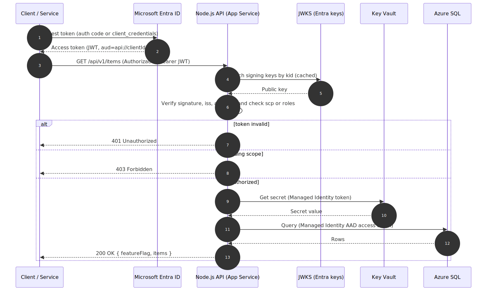

# Architecture

This document describes the target architecture, the authentication flow, the
deployment flow, and the monitoring topology. Diagrams are provided both as
Mermaid source (renders natively on GitHub / Azure DevOps) and as rendered
SVG/PNG in [`docs/diagrams/`](./diagrams).

---

## 1. System architecture

### Components

| Layer | Service | Purpose | Key hardening |
|------|---------|---------|---------------|
| Identity | **Microsoft Entra ID** | OAuth2/OIDC token issuer for the API | JWT validated on `iss`, `aud`, `exp`, signature (JWKS) |
| Compute | **App Service (Node.js API)** | Secure REST API | System-assigned MI, HTTPS-only, TLS 1.2, `/health`, VNet integration |
| Compute | **Function App (Python)** | Timer + HTTP triggers | System-assigned MI, identity-based storage |
| Data | **Azure SQL Database** | Relational store used by API | Entra-only auth (no SQL logins), TLS 1.2, private endpoint |
| Data | **Storage Account** | Blob store for Function output + host storage | Shared-key disabled (AAD only), no public blob access |
| Secrets | **Key Vault** | Secret storage | RBAC authorization, soft-delete, purge protection (prod), private endpoint |
| Observability | **Application Insights + Log Analytics** | Telemetry, logs, traces | Workspace-based, diagnostics from every resource |
| Ops | **Azure Monitor Alerts + Action Group** | Alerting | Availability, app-failure, infrastructure alerts |
| Network | **VNet + Private Endpoints + Private DNS** | Private data plane (prod) | Public access disabled on KV/SQL/Storage |

### Design principles

- **Passwordless everywhere.** Every service-to-service call uses a Managed
  Identity + Microsoft Entra ID token. There are no connection strings with
  passwords, no storage keys, and no SQL logins anywhere in code, config, IaC,
  or the pipeline.
- **Least privilege.** Each identity gets only the roles it needs
  (API → *Key Vault Secrets User*; Function → *Storage Blob Data Owner* +
  *Queue Data Contributor*; SQL → `db_datareader`/`db_datawriter` contained user).
- **Environment parity via a single artifact.** The same `api.zip` /
  `function.zip` and the same Bicep are promoted dev → prod; only parameters
  differ (SKU, private networking, purge protection).

---

## 2. Authentication & data-access flow

1. The client obtains an access token from Entra ID (authorization-code flow for
   users, client-credentials for services).
2. The token is presented to the API as a `Bearer` token.
3. The API validates the JWT against the tenant JWKS (cached), checking
   signature, issuer, audience and expiry, then authorizes on `scp`
   (delegated) or `roles` (application) claims.
4. On success the API uses its **Managed Identity** to read a secret from Key
   Vault and to obtain an Entra access token for Azure SQL — no stored
   credentials are involved.

---

## 3. Deployment flow (CI/CD)

- **Build & Test**: lint + unit tests + coverage for both apps; produces the two
  deployable artifacts.
- **Deploy Dev**: Bicep `what-if` → deploy → seed Key Vault secret → apply SQL
  schema + MI grants → zip-deploy apps → smoke tests.
- **Deploy Prod**: identical steps behind an **Environment approval** gate; only
  runs from `main`.
- **Secretless**: the service connection uses **Workload Identity Federation
  (OIDC)**; application secrets come from a Key Vault-backed variable group and
  are passed as secret variables.

---

## 4. Monitoring & alerting

- **Telemetry**: both apps emit to Application Insights (requests, dependencies,
  exceptions, custom events). All resources send **diagnostic settings** to the
  Log Analytics workspace.
- **Three alert classes** (the assignment's requirement) route to a shared
  Action Group:
  - **Availability** — a standard web test pings `/health` from 5 regions; alert
    fires when ≥ 2 locations fail.
  - **Application failure** — failed (5xx) requests > 5 in 5 minutes.
  - **Infrastructure** — App Service Plan CPU > 80% sustained over 15 minutes.

See [`MONITORING.md`](./MONITORING.md) for investigation and rollback playbooks.

---

## 5. Key trade-offs (summary)

| Decision | Chosen | Alternative | Why |
|---------|--------|-------------|-----|
| IaC | Bicep | Terraform | Azure-native, no state backend, first-class ARM parity |
| Hosting | Dedicated App Service Plan | Consumption Functions | Enables identity-based storage without a Files content share, VNet integration, no cold start; shared plan keeps cost down |
| Auth | Entra ID JWT | Custom auth / other IdP | Assignment-preferred, mature, MI-friendly |
| Secrets | KV + Managed Identity | App settings secrets | No secrets in source/history; auditable, rotatable |
| SQL auth | Entra-only | SQL logins | Eliminates password management entirely |

Full rationale is captured as ADRs in [`docs/adr/`](./adr).
